---

# 🏥 Health Application – Docker & Kubernetes Deployment Project

## ✅ Project Overview

This project successfully delivered a **containerized health web application** and deployed it on **Kubernetes** with advanced features. It covered building the app with Docker, pushing to IBM Cloud Container Registry, deploying via Kubernetes, implementing **Horizontal Pod Autoscaler (HPA)**, and managing **rolling updates and rollbacks**.

The project demonstrates practical skills in cloud-native application lifecycle management and container orchestration.

---

## 🎯 Objectives Achieved

1. Built and deployed a simple health web application using Docker and Kubernetes
2. Autoscaled the application using Horizontal Pod Autoscaler
3. Performed rolling updates and rollbacks for zero-downtime deployment

---

## 🛠 Step-by-Step Achievements

### 1. Repository Setup and Environment

* Cloned project artifacts from GitHub and prepared the environment.

### 2. Containerization with Docker

* Completed the multi-stage `Dockerfile` to build the health application image.
  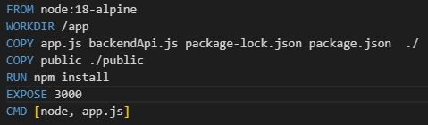

* Built and tagged the image, pushed it to IBM Cloud Container Registry.
  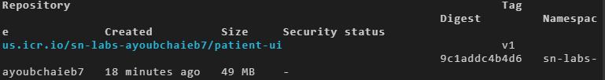

### 3. Kubernetes Deployment

* Created and applied the `deployment.yml` manifest.
  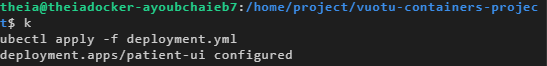

* Exposed the application locally via port-forward and launched it in the browser.
  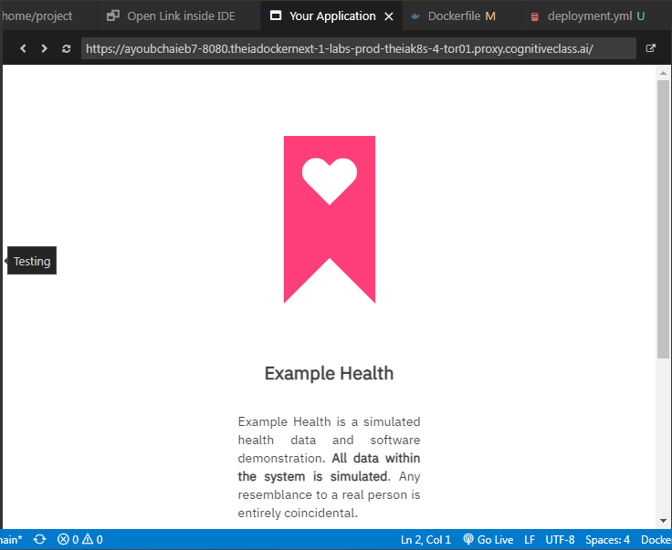
  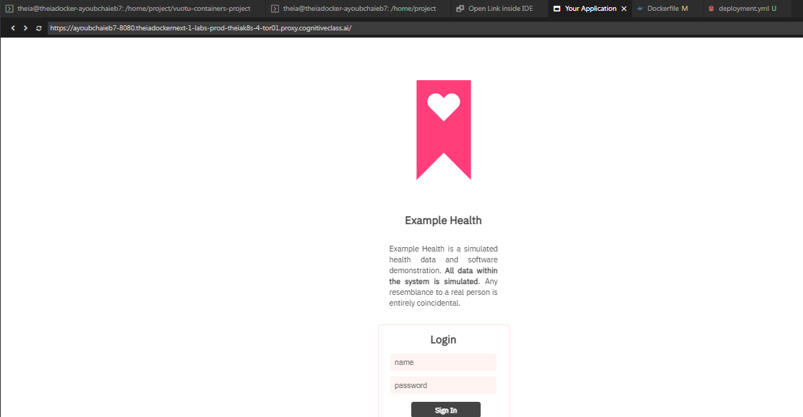

### 4. Autoscaling

* Configured the Horizontal Pod Autoscaler (HPA).
  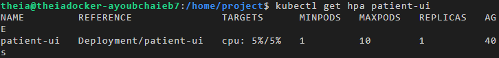

* Generated load and observed autoscaling behavior.
  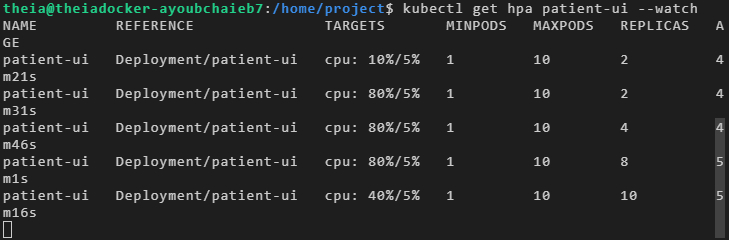

### 5. Rolling Updates & Rollbacks

* Updated the UI and pushed a new image.
  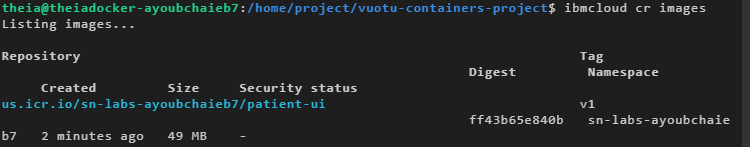

* Applied the updated deployment and confirmed the UI changes.
  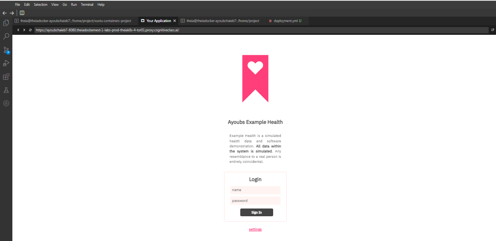

* Verified rollout history and details.
  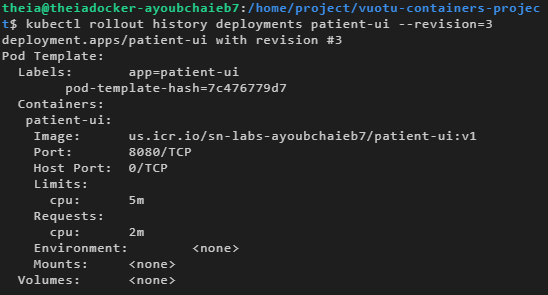

* Checked replica sets after updates and rollback.
  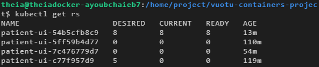

---

## 📦 Deliverables

* **Dockerfile** – Multi-stage optimized build
* **deployment.yml** – Kubernetes deployment manifest
* **patient-ui** – Web frontend application
* **Images folder** – Screenshots in `/images` for documentation

---

## 🧠 Skills Demonstrated

* Docker image building and pushing to registry
* Kubernetes deployments and rolling strategies
* Horizontal Pod Autoscaling setup and testing
* Load generation and cluster monitoring
* Rolling updates and rollback management

---

## 👨‍💻 Author

Developed by **Ayoub CHAIEB**
Based on IBM Skills Network final container orchestration project

---
